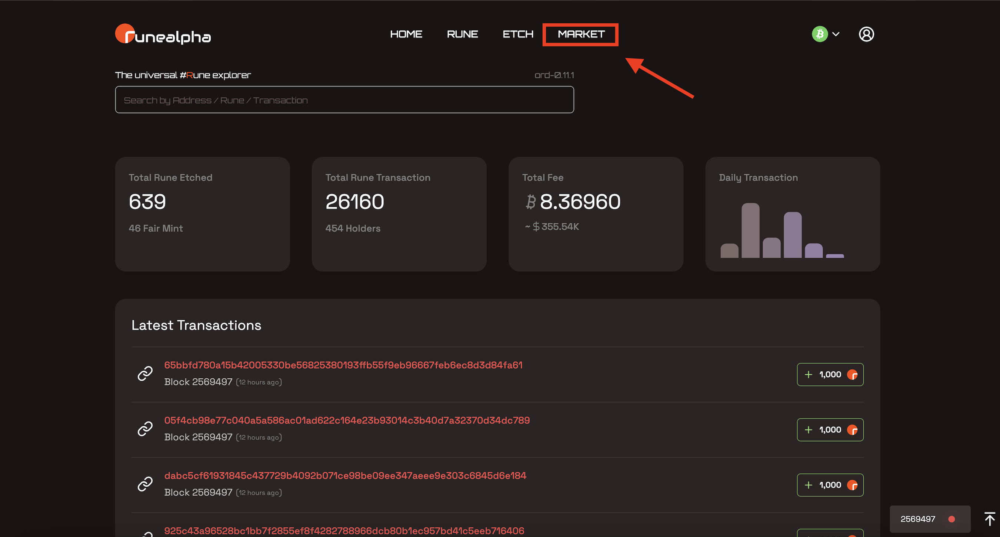

# 上架符文

**注意**: **Listing是完全免费的，因为我们使用PSBT，但请注意，取消上架需要您进行交易，这意味着您将放弃一些sats来刷新上架期间使用的UTXO.**

步骤1: 在首页点击市场

<figure><figcaption></figcaption></figure>

步骤2: 选择您想要交换的符文

<figure><figcaption></figcaption></figure>

步骤3: 单击列表符文按钮，显示可用的符文列表

<figure><figcaption></figcaption></figure>

步骤4: 选择您想要在弹出框中列出的确切符文

<figure><figcaption></figcaption></figure>
